KitchenNG
============

## 1. Table of contents

| Section | Title |
|--- | ---|
| 2 | [The aim of this project](./README.md#2-the-aim-of-this-project) |
| 3 | [The design](./README.md#3-the-design) |
| 4 | [Link to the API part of the project](./README.md#4-link-to-the-api-part-of-the-project) |

## 2. The aim of this project

Kitchen is a web application designed to manage recipes. I wrote this program myself in my spare time.
I mainly worked on it for about 3 months when I was also looking for a job in April 2023.

## 3. The design

I've created a user interface using the bootstrap framework, which gives a clear, efficient and responsive, if slightly generic, look.

### 3.1 "The design" table

| Section | Title |
|--- | ---|
| 3.2 | [Recipe list](./README.md#32-recipe-list) |
| 3.3 | [Recipe details](./README.md#33-recipe-details) |
| 3.4 | [Category, ingredient and preparation step details](./README.md#34-category-ingredient-and-preparation-step-details) |
| 3.5 | [Category list](./README.md#35-category-list) |
| 3.6 | [Ingredient list](./README.md#36-ingredient-list) |

### 3.2 Recipe list

The central page is the recipe list. It includes several components such as the search bar used to filter searches, a button to add a recipe, pagination and finally the recipe list.

#### The list

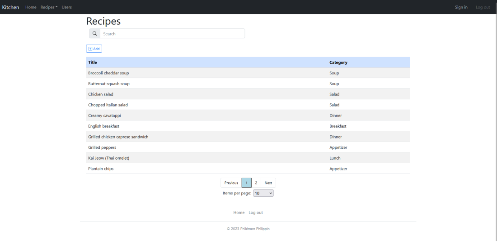

#### The pagination

Pagination allows you to choose the number of recipes displayed, as well as the page number required.

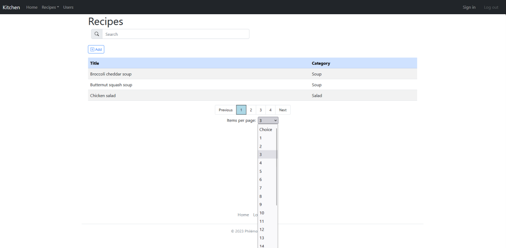

#### Add recipe

The "Add" button displays a component enabling us to add a recipe to the list.

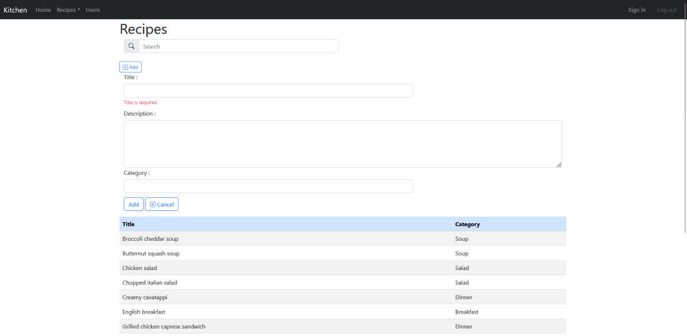

### 3.3 Recipe details

When you select a recipe from the list, you are taken to a page containing details of that recipe. Here are two screenshots showing this page.

#### Recipe details and ingredients

The first part of the page presents the details of the recipe, as well as the ingredients it contains.

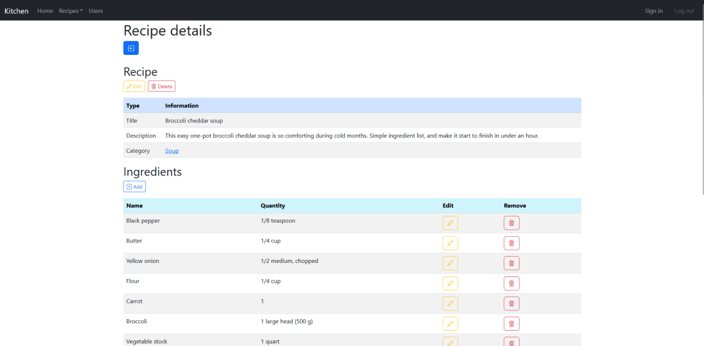

#### Recipe details and preparation steps

The second part of the page presents the preparation steps of the recipe.

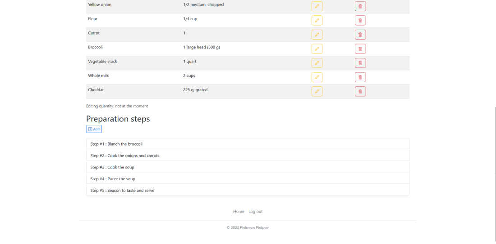

#### Recipe edit

A component is displayed when the Edit button is clicked to modify the recipe in question.

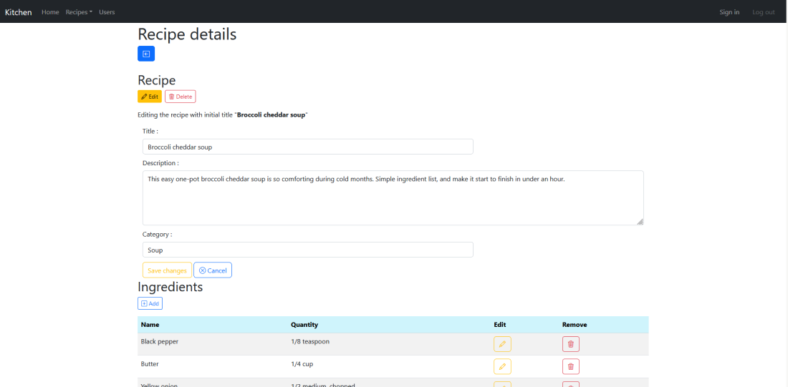

#### Edit recipe ingredients

A little further down, in the recipe's ingredient list, we can change the quantity of the ingredient concerned by clicking on the yellow button. The "Add" button is used to add an ingredient to the recipe.

At the very bottom of the page, the "Add" button lets you add preparation steps to the recipe. Each item on this page is selectable. You can click on the recipe category, on an ingredient or on a recipe preparation step.

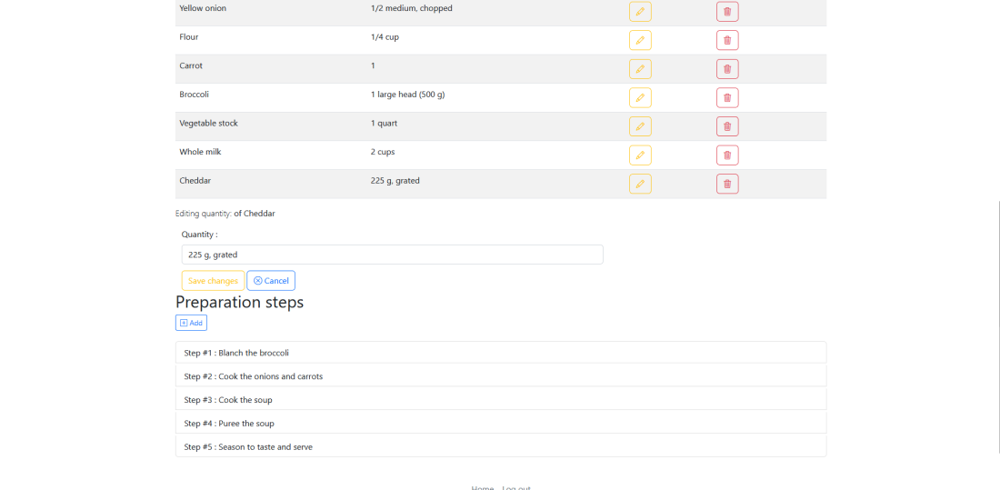

### 3.4 Category, ingredient and preparation step details

Selecting the recipe category takes us to the category details page. The design of this page is reused for the ingredient details and preparation step details pages.  
These three pages allow us to consult detailed information on the entity in question, and also to modify or delete it completely.

#### Category details

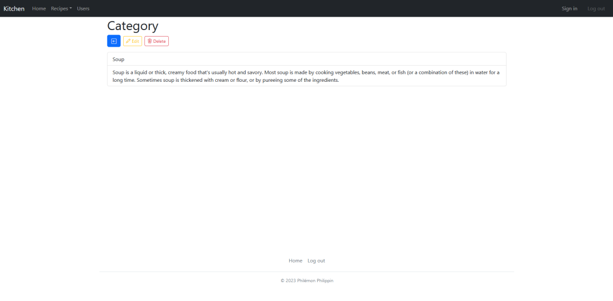

#### Ingredient details

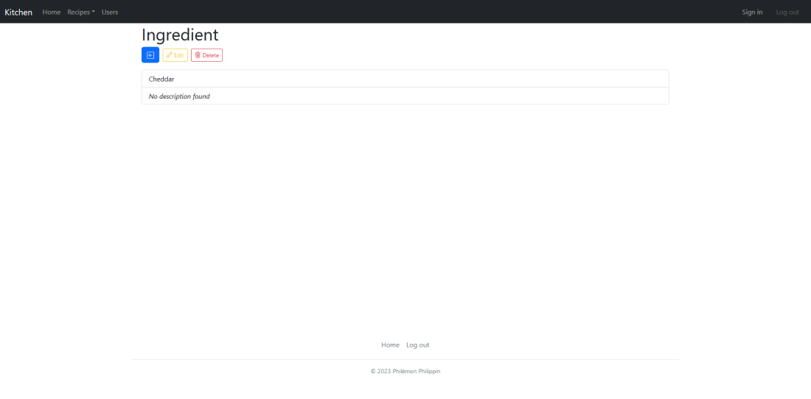

#### Preparation step details

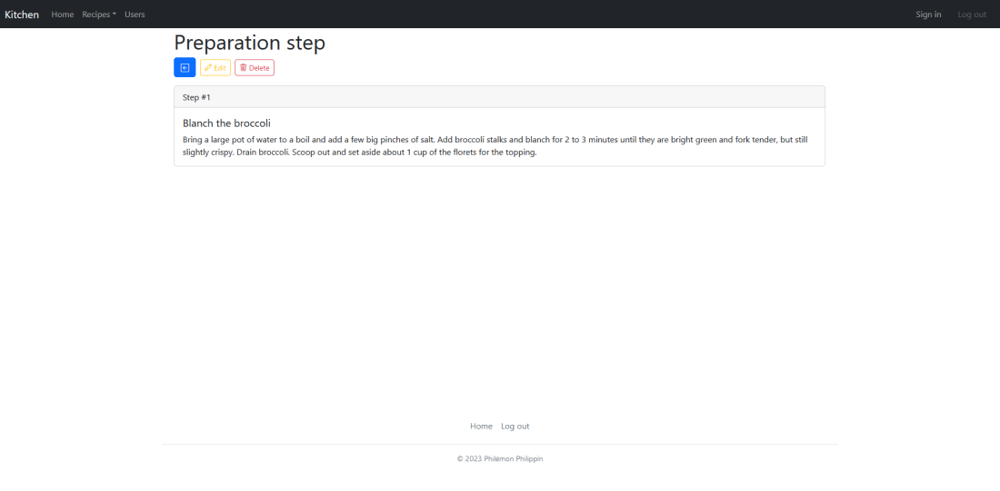

### 3.5 Category list

The navigation bar takes us to the page displaying the list of categories.

### 3.6 Ingredient list

The navigation bar also takes us to the page displaying the list of ingredients. Here, too, we find the pagination component, allowing us to select the number of ingredients to be displayed and the number of the desired page.

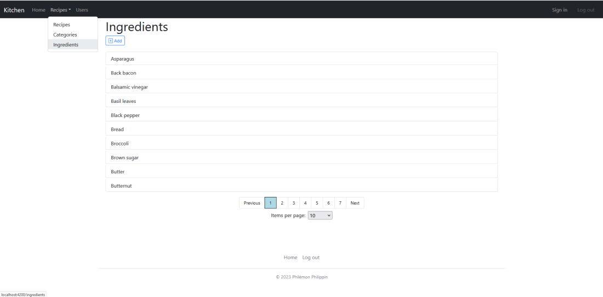

## 4. Link to the API part of the project

To see more details about the purpose of this project, the circumstances in which it was built and the technology used to make the server part, you can consult the API to which this project is linked at : [Kitchen-repo](https://github.com/PhilemonPhilippin/Kitchen-repo)
